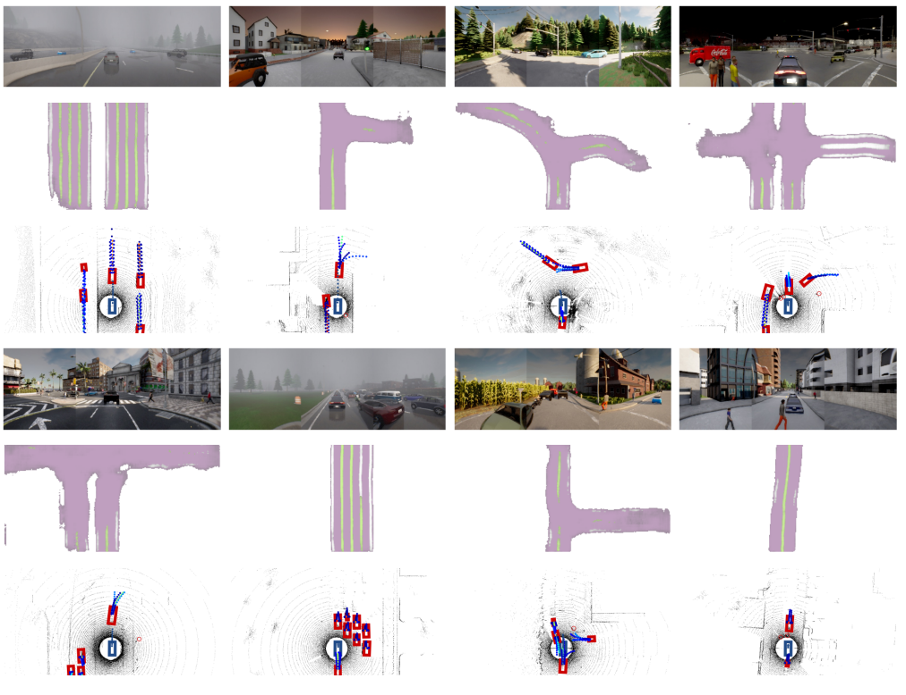
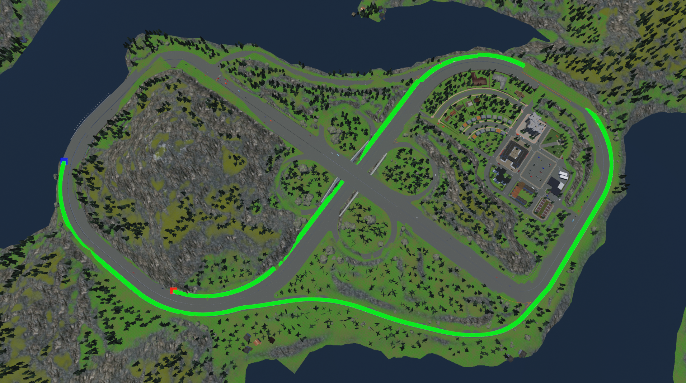

# Learning from All Vehicles
### [Link to Article](https://arxiv.org/pdf/2203.11934.pdf)
---
## Summary
Learning from All Vehicles is a sensor-based, learning-based, end-to-end driving system that uses its sensors to learn from all the vehicles around it, as opposed to only learning from its own position by predicting future trajectories for all the cars around it. This allows it to gain experiences at a much faster rate, catching edge cases faster and training the ego vehicle faster. The main problem to overcome is the fact that the sensors exist only on the ego vehicle, not on the vehicles around it. This is overcome by training a motion planner that learns to map out the expected route for surrounding cars by using their actual trajectory for supervision. This motion planner gives the ego vehicle more complex reasoning, allowing it to avoid collisions in real time driving scenarios. 

## Learning from all vehicles

The driving model consists of three parts: a perception module in the form of 2D spatial feature map, a motion planner, and a low-level controller. 

### Perception Module
The perception module uses three RGB cameras and one LiDAR sensor to generate a map of the surrounding area. A CenterPoint style detector is trained to identify each object and distinguish between pedestrians, vehicles and the ego vehicle. The perception model was pre-trained using fully labelled data and rotation augmentation in order to add to the strength of the model. This supervised pre-training allows researchers to standardize the data output for the motion planner. 

### Motion Planner
The motion planner uses the output from the perception to predict future movements for all the surrounding vehicles by combining GPS targets and discrete high-level commands, such as turn-left, turn-right, go-straight, follow-lane, change-lane-to-left, change-lane-to-right. Since high-level commands for other vehicles isn't known, a motion refinement network is used to minimize noise from the other vehicles. This refinement network was trained on ego-vehicle trajectories. The motion planner waas originally trained using privileged information, with knowledge about future trajectories. This privileged motion planner is then used with the perception module supervise our final motion planner that uses inferred perception outputs. In this stage, a high-level command classifier is built for all the vehicles which is used in the controller. 

### Vehicle-Aware Controller
The controller translates the commands generated in the motion planner into actual driving commands. PID controllers are used for steering and acceleration/braking. Both PID controllers produce a continuous output command based off of constantly updating data from the motion planner, with the acceleration PID also having access the the speedometer to compute acceleration. Braking is overwritten to take into account traffic lights, stop signs, and hazard stops from the motion planner that prevents collisions. 

## Testing
The Carla Leaderboard tests driving agents by putting them through a series of predefined routes that take the agent through a variety of areas and driving situations while also exposing the agent to various weather conditions. Agents are scored based off of a driving score (0-100) that considers the percentage of the route completed while also deducting points for infractions, such as collisions, route deviations, running redlights, and off-road driving. When LAV was first submitted, it took number one on the leaderboard by a wide margin, out performing the previous leader by 25 points. 
