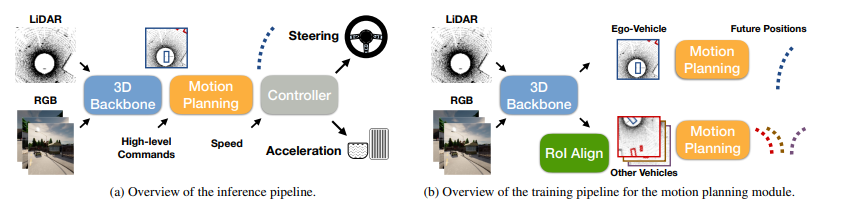
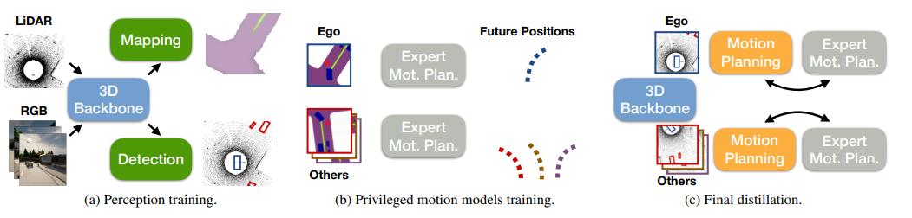
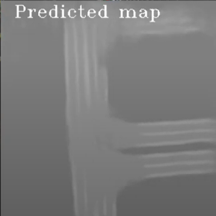
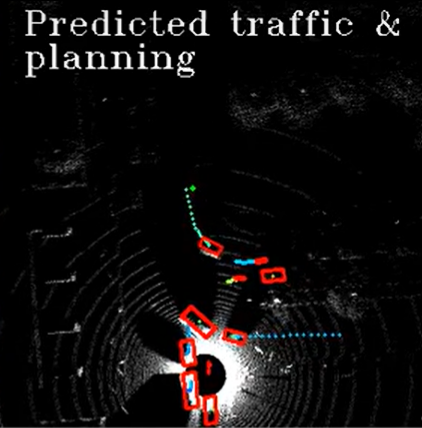

# Learning from All Vehicles
### [Link to Article](https://arxiv.org/pdf/2203.11934.pdf)
---
## Summary
Learning from All Vehicles is a sensor-based, learning-based, end-to-end driving system that uses its sensors to learn from all the vehicles around it, as opposed to only learning from its own position by predicting future trajectories for all the cars around it. This allows it to gain experiences at a much faster rate, catching edge cases faster and training the ego vehicle faster. The main problem to overcome is the fact that the sensors exist only on the ego vehicle, not on the vehicles around it. This is overcome by training a motion planner that learns to map out the expected route for surrounding cars by using their actual trajectory for supervision. This motion planner gives the ego vehicle more complex reasoning, allowing it to avoid collisions in real time driving scenarios. 

## Learning from all vehicles

The driving model consists of three parts: a perception module in the form of 2D spatial feature map, a motion planner, and a low-level controller. 

### Perception Module
The perception module uses three RGB cameras and one LiDAR sensor to generate a map of the surrounding area. A CenterPoint style detector is trained to identify each object and distinguish between pedestrians, vehicles and the ego vehicle. The perception model was pre-trained using fully labelled data and rotation augmentation in order to add to the strength of the model. This supervised pre-training allows researchers to standardize the data output for the motion planner. 

### Motion Planner
The motion planner uses the output from the perception 
