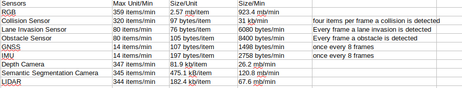

# CARLA Installation
Note: This is for Ubuntu 18.04
## Prerequisites:
The Unreal engine build takes about 95 GB, and the Carla build takes about 20 GB. These values can fluxuate as Carla is run, as Carla generates a lot of temp files while running. Reserveing 130 GB total for the entire build should be sufficient. 
Installations through apt-get:
```
sudo apt-get install build-essential clang-8 lld-8 g++-7 cmake ninja-build libvulkan1 python python-pip python-dev python3-dev python3-pip libpng-dev libtiff5-dev libjpeg-dev tzdata sed curl unzip autoconf libtool rsync libxml2-dev git clang
```
Install Distro from PyPI:
```
pip3 install distro
```
Install [Vulkan Drivers](https://linuxconfig.org/install-and-test-vulkan-on-linux):
```
sudo add-apt-repository ppa:oibaf/graphics-drivers
sudo apt update
sudo apt upgrade
apt install libvulkan1 mesa-vulkan-drivers vulkan-utils
```
## Install the modified version of Unreal Engine 
```
git clone --depth 1 -b carla https://github.com/CarlaUnreal/UnrealEngine.git ~/UnrealEngine_4.26
cd ~/UnrealEngine_4.26
./Setup.sh && ./GenerateProjectFiles.sh && make
```
If you need to verify that the installation is correct:
```
cd ~/UnrealEngine_4.26/Engine/Binaries/Linux && ./UE4Editor
```

### Build Carla
This can be done concurrently with the Unreal Engine install
```
sudo apt-get install aria2
git clone https://github.com/carla-simulator/carla
cd carla
./Update.sh
```

### Running Carla
```
export UE4_ROOT=~/UnrealEngine_4.26
make PythonAPI
make launch
```
Carla will compile a lot of shaders the first time it is run. It is most optimal to leave the launched CARLA for a bit to compile all of these. This process should take about half an hour. 

After terminating a python script in Python, sometimes the process is not killed automatically, returning an error message about the rbc server being busy. Run the following command: 
```
pkill -9 python
```
Carla Sensors intake data at approximately the following rates: 


Installing Tensorflow: 
The currently installed version of Pytorch is 1.9.0+cu111 and Tensorflow is 20.8. These are the specific versions that are compatible with Cuda on the computer and any other versions of Pytorch or Tensorflow will probably not work. 

### myLBC
myLBC is a custom version of the LearningByCheating self-driving algorithm that allows the user to inject one of four different attacks to obscure the agent's view. Installation can be done using the following scripts: 
```
# Download CARLA 0.9.6
wget http://carla-assets-internal.s3.amazonaws.com/Releases/Linux/CARLA_0.9.6.tar.gz
mkdir carla_lbc
tar -xvzf CARLA_0.9.6.tar.gz -C carla_lbc
cd carla_lbc

# Download LBC
git init
git remote add origin https://github.com/piazzesiNiccolo/myLbc.git
# rename the LICENSE file to avoid conflicts during the pull
mv LICENSE CARLA_LICENSE 
git pull origin HEAD
wget http://www.cs.utexas.edu/~dchen/lbc_release/navmesh/Town01.bin
wget http://www.cs.utexas.edu/~dchen/lbc_release/navmesh/Town02.bin
mv Town*.bin CarlaUE4/Content/Carla/Maps/Nav/

# Create conda environment
conda env create -f environment.yml
conda activate carlaLBT

# Install carla client
cd PythonAPI/carla/dist
rm carla-0.9.6-py3.5-linux-x86_64.egg
wget http://www.cs.utexas.edu/~dchen/lbc_release/egg/carla-0.9.6-py3.5-linux-x86_64.egg
easy_install carla-0.9.6-py3.5-linux-x86_64.egg

# Download model checkpoints
cd ../../..
mkdir -p ckpts/image
cd ckpts/image
wget http://www.cs.utexas.edu/~dchen/lbc_release/ckpts/image/model-10.th
wget http://www.cs.utexas.edu/~dchen/lbc_release/ckpts/image/config.json
cd ../..
mkdir -p ckpts/priveleged
cd ckpts/priveleged
wget http://www.cs.utexas.edu/~dchen/lbc_release/ckpts/privileged/model-128.th
wget http://www.cs.utexas.edu/~dchen/lbc_release/ckpts/privileged/config.json
cd ../..
```
To run: 
```
./CarlaUE4.sh -fps=10 -benchmark
export PYTHONPATH="`pwd`/PythonAPI:$PYTHONPATH" 
CUDA_VISIBLE_DEVICES="0" python3 benchmark_agent.py --suite=town2 --model-path=ckpts/image/model-10.th --show
```

### LAV
LAV is an autonomous driving agent built for CARLA. 
## Installation: 
* Install [git lfs](https://git-lfs.github.com/).
* Download this repo `git clone --recurse-submodules git@github.com:dotchen/LAV.git`
* Download and unzip [CARLA 0.9.10.1](https://github.com/carla-simulator/carla/releases/tag/0.9.10.1)
* Create a dedicated Conda Environment ` conda env create -f environment.yaml `
* Inside the conda environment, install the CARLA PythonAPI `easy_install [PATH TO CARLA EGG]`. Refer to [this link](https://leaderboard.carla.org/get_started/) if you are confused at this step.
* Install [PyTorch](https://pytorch.org/get-started/locally/)
* Install [torch-scatter](https://github.com/rusty1s/pytorch_scatter) based on your `CUDA` and `PyTorch` versions.
* Setup [wandb](https://docs.wandb.ai/quickstart)
* Set Environment Variables: 
```bash
#!/bin/bash

export CARLA_ROOT=[LINK TO YOUR CARLA FOLDER]
export LEADERBOARD_ROOT=[LINK TO LAV REPO]/leaderboard
export SCENARIO_RUNNER_ROOT=[LINK TO LAV REPO]/scenario_runner
export PYTHONPATH="${CARLA_ROOT}/PythonAPI/carla/":"${SCENARIO_RUNNER_ROOT}":"${LEADERBOARD_ROOT}"
export TEAM_AGENT=[LINK TO LAV REPO]/team_code/lav_agent.py
export TEAM_CONFIG=[LINK TO LAV REPO]/team_code/config.yaml

export SCENARIOS=${LEADERBOARD_ROOT}/data/all_towns_traffic_scenarios_public.json
export REPETITIONS=1
export CHECKPOINT_ENDPOINT=results.json
export DEBUG_CHALLENGE=0
export CHALLENGE_TRACK_CODENAME=SENSORS
```
## Training
Download a subset of the [LAV dataset](https://utexas.box.com/s/evo96v5md4r8nooma3z17kcnfjzp2wed) and update the file location of data_dir in the config.yaml
* Priveledged Motion Planning ` python3 -m lav.train_bev `
* Semantic Segmentaion ` python3 -m lav.train_seg `
* RGB Braking Prediction ` python3 -m lav.train_bra `
* Point Painting ` python3 -m lav.data_paint `
* Preception Pre-training ` python3 -m lav.train_full --perceive-only `
* Update the lidar_model_dir in the config.yaml
* End-to-end Training ` python3 -m lav.train_full `

LAV requires a significant amount of GPU memory to run. If there are error messages regarding GPU storage usage, lower the batch size by appending ` --batch-size N ` where N is the desired batch size to the python commands or lower the default batch size in the respective python file. 

LAV training creates .th files that are used by the agent and by the end-to-end training. These files are located in the files folder of the respective run and can be opened using [Therion] (https://therion.speleo.sk/). 

An example model can be run using ` ROUTES=leaderboard/data/routes_valid.xml ./leaderboard/scripts/run_evaluation.sh ` The spectator camera can be malipulated around the car using line 192 of ` /leaderboard/leadeboard/scenarios/scenario_manager.py `

It is recommended to use the .sh version of CARLA as opposed to the URE version because it requires less computing power. 
